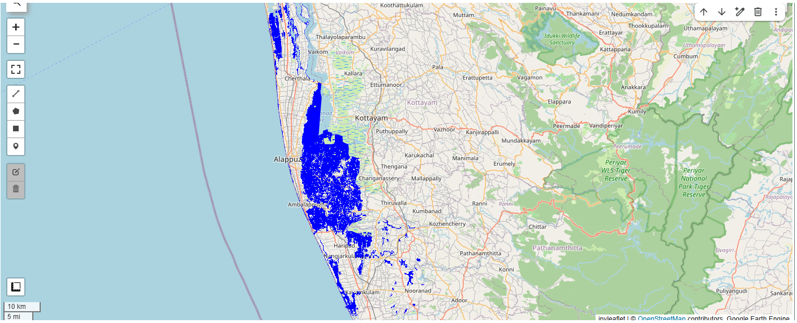
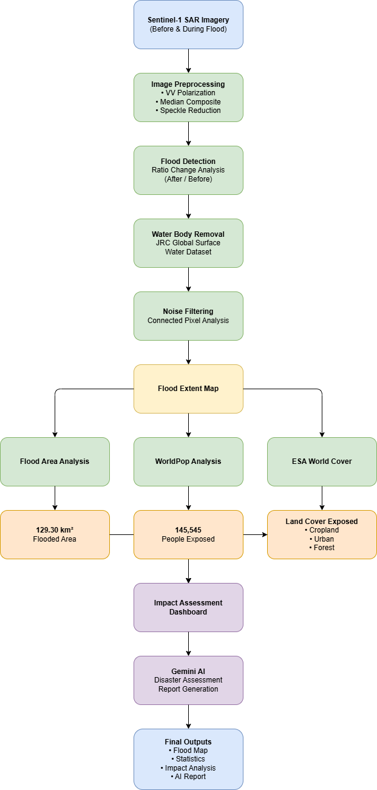
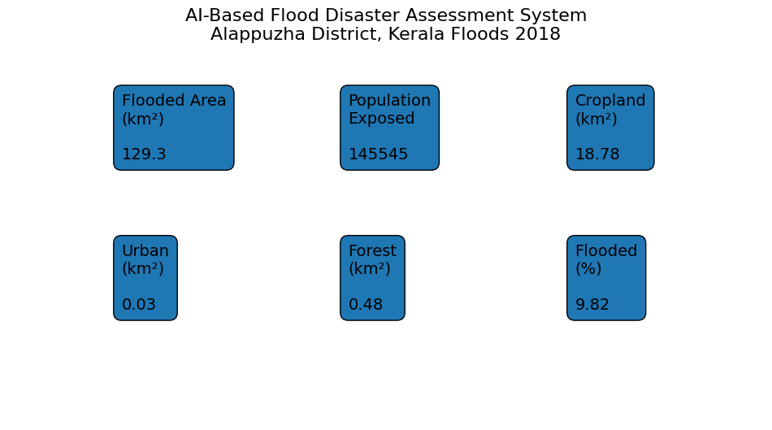

# AI-Based Flood Disaster Assessment System
AI-powered flood disaster assessment system using Sentinel-1 SAR, Google Earth Engine, WorldPop, ESA WorldCover, and Gemini AI.
Overview
---

---
---
## Project Highlights

- Automated flood detection using Sentinel-1 SAR imagery
- Flood extent mapping and inundation analysis
- Population exposure assessment using WorldPop
- Land-use impact assessment using ESA WorldCover
- AI-powered disaster assessment report generation using Gemini AI
- End-to-end GeoAI workflow implemented in Google Earth Engine
---
##  Project Overview

This project uses:

- Sentinel-1 SAR imagery for flood detection
- Google Earth Engine for large-scale geospatial processing
- WorldPop population data for exposure assessment
- ESA WorldCover land-cover data for impact analysis
- Google Gemini AI for automated disaster report generation

The workflow was demonstrated using the **2018 Kerala Floods** in **Alappuzha District, Kerala, India**.

---

##  Study Area

**Location:** Alappuzha District, Kerala, India

**Event:** Kerala Floods 2018

---

##  Workflow

```text
Sentinel-1 SAR Imagery
        ↓
Image Preprocessing
        ↓
Flood Detection
        ↓
Flood Extent Mapping
        ↓
Population Exposure Analysis
        ↓
Land Use / Land Cover Impact Analysis
        ↓
Gemini AI Report Generation
        ↓
Final Disaster Assessment Report
```

---

##  Technologies Used

- Python
- Google Earth Engine
- Google Colab
- Sentinel-1 SAR
- WorldPop
- ESA WorldCover
- Geemap
- Google Gemini AI

---

##  Results

| Metric | Value |
|----------|----------|
| Flooded Area | 129.30 km² |
| District Area | 1316.69 km² |
| Flooded Percentage | 9.82% |
| Population Exposed | 145,545 |
| Flooded Cropland | 18.78 km² |
| Flooded Urban Area | 0.03 km² |
| Flooded Forest Area | 0.48 km² |

---

## Key Features

* Flood detection using Sentinel-1 SAR imagery

* Flood extent calculation

* Population exposure assessment using WorldPop

* Land-use impact assessment using ESA WorldCover

* AI-generated disaster assessment reports using Gemini AI

* End-to-end GeoAI workflow

---
## Installation

```bash
git clone https://github.com/vishnuvenu432/AI-Flood-Disaster-Assessment-System.git

cd AI-Flood-Disaster-Assessment-System

pip install -r requirements.txt
```
---

##  Repository Structure

```text
AI-Flood-Disaster-Assessment-System/
│
├── README.md
├── requirements.txt
│
├── notebook/
│   └── AI_Based_Flood_Disaster_Assessment_System.ipynb
│
├── images/
│   ├── workflow_diagram.png
│   ├── flood_extent_map.png
│   └── results_dashboard.png
│
└── outputs/
    └── Flood_Disaster_Assessment_Report.txt
```

---

## Project Outputs

### Flood Extent Map



### Workflow Diagram



### Results Dashboard



### AI Disaster Assessment Report

A sample AI-generated disaster assessment report is available in:
[View AI Disaster Assessment Report](outputs/Flood_Disaster_Assessment_Report.txt)
---

## Future Improvements

- Infrastructure impact assessment
- Road network exposure analysis
- Hospital and school impact analysis
- Streamlit web dashboard
- Automated PDF report generation
- Multi-disaster assessment framework

---

## Applications

- Disaster Management
- Emergency Response Planning
- Flood Risk Assessment
- Climate Resilience Studies
- GeoAI Research
- Government Decision Support Systems

---

## Author

**Vishnu Venu**

GIS Analyst | GeoAI Enthusiast | Remote Sensing & Spatial Data Science

---
